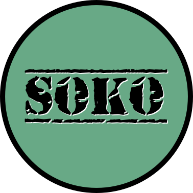

# soko

Help private Enos escape the enemy base.

Collect the key to open the secured area to escape.
Collect hex for points along the way.
What is your best score?

### Credits

Image Assets

- Game Art Guppy: https://www.gameartguppy.com/shop/
	- All art was downloaded from Game Art Guppy, but turned into pixel art with Pixelorama [32x32 px]

Font Credit:

- Kenney.nl: https://kenney.nl/assets/kenney-fonts
- DaFont: https://www.dafont.com/old-stamper.font

Sounds Credit:

- "band_of_thieves.ogg": Opening Scene
	- TKZ Productions:  https://opengameart.org/content/band-of-thieves
- "covert_operations.ogg": Level Music
	- artisticdude: https://opengameart.org/content/covert-operations
- "evasion.ogg": Level Music
	- Matthew Pablo:  https://opengameart.org/content/evasion
- "coffin_dance.ogg": End
	- DigiNeko: https://www.youtube.com/watch?v=j9V78UbdzWI
	- Edited at about 32 seconds to pull out the sound file
- wobbleboxx: https://opengameart.org/content/level-up-power-up-coin-get-13-sounds
	- These were converted to .OGG files with Audacity
- "WilhelmScream.ogg": You Died
	- https://en.wikipedia.org/wiki/Wilhelm_scream
- "leveldone.ogg": Win Screen
	- Thanks to SuperTux2: https://www.supertux.org/

### Tools Used

- Godot Engine: https://godotengine.org/

- Pixelorama: https://orama-interactive.itch.io/pixelorama

- Inkscape: https://inkscape.org/

- Gimp: https://www.gimp.org/

- OBS:  https://obsproject.com/download

- OpenShot: https://www.openshot.org

- Audacity:  https://www.audacityteam.org/

## License

This game is open source and released under the MIT License. See the [LICENSE](LICENSE) file for details.

**Play it on Itch.io:** https://bitsofjeremy.itch.io/