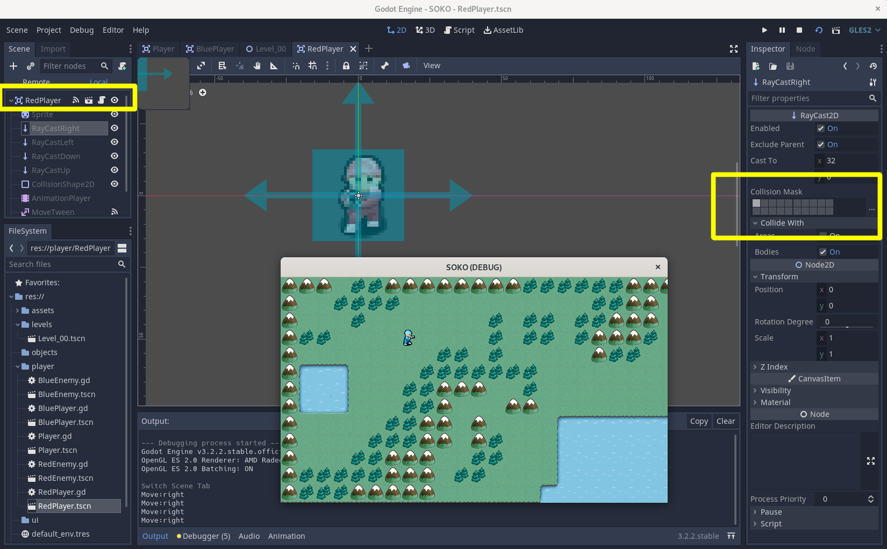

[DEVLOG][01a]

### BUG

- Get player to not walk through obstacles
- How I fixed:
	- I forgot to set the correct collision layer and mask on the Player
	- This took me about a week t0 find the fix as I kept looking at code versus Godot's UI

### SCREENSHOT

